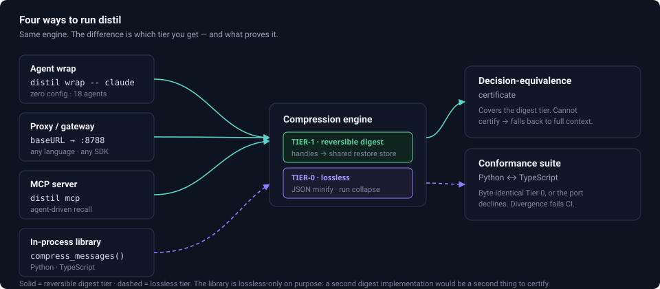
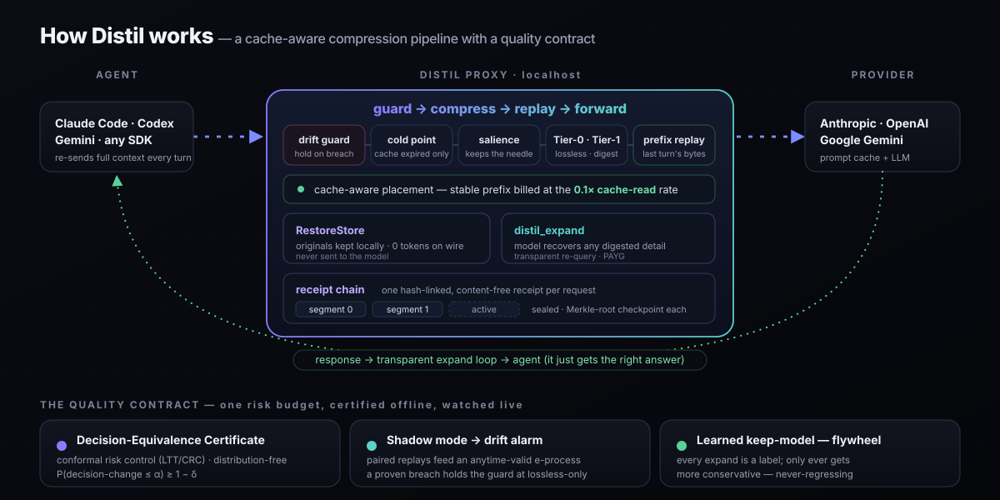

<!-- mcp-name: io.github.dshakes/distil -->
<p align="center">
  
</p>

<p align="center">
  <a href="https://github.com/dshakes/distil/actions/workflows/ci.yml"></a>
  <a href="https://pypi.org/project/distil-llm/"></a>
  <a href="https://www.npmjs.com/package/distil-llm"></a>
  <a href="https://pypi.org/project/distil-llm/"></a>
  <a href="LICENSE"></a>
  <a href="#-what-we-wont-pretend"></a>
  <a href="https://dshakes.github.io/distil/architecture.html"></a>
  <a href="https://dshakes.github.io/distil/adoption.html"></a>
</p>

<h2 align="center">Something is rewriting your agent's context.<br/>Distil measures what it cost you.</h2>

<p align="center"><b>Your provider now edits the context window for you — clearing old tool results, summarizing history — by default, server-side, with no report of what changed.</b><br/>Distil is the instrument that answers the only question that matters: <b>did the agent still do the same thing?</b></p>

<table align="center">
<tr><td>

**We pointed it at the providers.** Anthropic's **default** context-editing policy (`keep=3`) changed the
agent's next action in **95–100% of cases**, against a 2.5% A/A noise floor. Keeping the 3 most recent
tool uses didn't lower the change rate at all — it turned *stalling* into *acting on missing facts*.
OpenAI's compaction changed **12.5–20%**. Pre-registered, replicated, n=40 per run.

**[Read the study →](https://dshakes.github.io/distil/provider-compaction.html)** · [rerun it on your own config](https://dshakes.github.io/distil/provider-compaction.html#reproduce)

</td></tr>
</table>

<p align="center">Distil also <b>compresses</b> — the tool output, logs, and history your agent re-sends every turn, reversibly.<br/>It's the one context operation that ships with its own certificate.</p>

## What it does

- **Wrap your agent** — `distil wrap -- claude` · `codex` · `gemini` · `aider` · `opencode` · `qwen` · `goose` · `grok` · `openhands`. Zero config, no code change.
- **Run a proxy** — point any `base_url` client at it. Python, TypeScript, any language, any framework.
- **Call it as a library** — `from distil import compress_messages` in your own agent loop.
- **Give your agent a recall tool** — MCP server: it compresses its own output and gets the exact bytes back on demand.
- **Framework hooks** — LangChain · LangGraph · LiteLLM · Agno · Strands, in-process, no network hop.
- **On a subscription** — `distil hook --install`: Claude Code compresses its own tool output through
  the documented `PostToolUse` extension point. No proxy, no credentials touched. `distil quota` shows
  the rate-limit window it buys back. [Details →](https://dshakes.github.io/distil/subscription.html)
- **See what it did** — live status line, session dissect, per-request headers, OTel spans, Prometheus metrics.

```bash
pipx install distil-llm && distil onboard    # detects your agent + billing, wires everything
```

> **Not sure which of those you want?** [Two questions pick your mode →](https://dshakes.github.io/distil/which-mode.html) — plain language, honest savings ranges, no jargon.

<p align="center">
  
</p>

<p align="center">
  
</p>

> **Will it save you money?** On **metered billing** (an API key), yes — directly, off the bill.
> On a **flat-rate Pro/Max subscription** there is no per-token bill to cut, but there *is* a
> rate-limit window, and spending fewer tokens per turn leaves more of it for the next task.
> `distil quota` shows that window live. Savings come from **large, repetitive** tool output:
> verbose JSON and duplicated log runs compress 25–99%, while prose and unique-line output
> compress ~0% — a short session that never reads a big file showing near 0% is the tool working
> correctly, not failing. [Why →](#-compression-modes--in-plain-english)

<!-- ═══ LIVE community counter — fed by the opt-in census, re-polls every 5 min ═══ -->
<p align="center"><sub>◉ &nbsp;<b>LIVE</b> · measured from the opt-in census on a <a href="https://github.com/dshakes/distil/tree/metrics">public git branch</a>, never estimated</sub></p>
<p align="center">
  <a href="https://dshakes.github.io/distil/adoption.html"></a>
  <a href="https://dshakes.github.io/distil/adoption.html"></a>
  <a href="https://dshakes.github.io/distil/adoption.html"></a>
</p>
<p align="center"><b><a href="https://dshakes.github.io/distil/adoption.html">▶ &nbsp;Watch the counter tick live &amp; audit every number →</a></b></p>

<table align="center"><tr>
<td align="center"><b>⚡ Get the savings</b><br/><sub>2 min, no config</sub><br/><br/><code>pipx install distil-llm</code><br/><code>distil onboard</code></td>
<td align="center"><b>🔬 See the proof</b><br/><sub>real harness</sub><br/><br/><a href="#-the-proof"><b>benchmark ↓</b></a> · <a href="docs/PAPER.md">paper</a><br/><a href="https://dshakes.github.io/distil/compare.html">vs the others</a></td>
</tr></table>

<p align="center">
  <a href="#-use-it-now">Use it</a> ·
  <a href="#-use-it-as-a-library">Library</a> ·
  <a href="#-works-with-every-sdk">Integrations</a> ·
  <a href="#-install-your-way">Install</a> ·
  <a href="#why-trust-it">Why trust it</a> ·
  <a href="https://dshakes.github.io/distil/getting-started.html"><b>Full Docs →</b></a>
</p>

---

## 🧩 Use it as a library

Building the agent yourself? Compress the message list where it lives — no proxy, no network hop:

```python
from distil import compress_messages, expand_handle

result = compress_messages(messages)          # OpenAI/Anthropic-style dicts
print(f"{result.saved_pct:.1f}% smaller")
response = client.messages.create(model=..., messages=result.messages)

original = expand_handle(result.handles[0])   # byte-exact, any time, any process
```

Tool results get the reversible digest; user and system text get lossless transforms only; **the model's own turns are never rewritten**. Handles resolve across processes and restarts, so a digest made by the proxy expands here and vice versa. `verbatim=True` disables digests entirely.

<sub>Named `compress_messages`/`expand_handle` rather than `compress`/`expand` because `distil.compress` and `distil.expand` are modules — a top-level export sharing those names would resolve to the function or the module depending on unrelated import order.</sub>

TypeScript too — `compress(messages)` from the [npm package](https://www.npmjs.com/package/distil-llm), byte-identical to the Python engine. Full reference: **[Library API →](https://dshakes.github.io/distil/library.html)** · runnable examples: [`python_library.py`](examples/python_library.py) · [`js_library.ts`](examples/js_library.ts).

**Maintain a framework?** [`docs/INTEGRATING.md`](docs/INTEGRATING.md) is the ~20 lines and the four rules — we would rather the integration live in your repo than ours.

---

<h3 align="center" id="why-trust-it">Why trust it 📊</h3>

<p align="center"><b>Every other compressor asks you to <i>trust</i> it won't break your agent. Distil is the only one that proves it won't.</b><br/>On <b>500 real coding tasks</b>, compressed context <b>matched full context within statistical noise</b>: <b>42.0% vs 39.2%</b>. <sub>(SWE-bench Verified)</sub></p>

<p align="center"><sub>Honest scope: +2.8pp is a point estimate (CI −0.6..+6.2pp — <b>non-inferiority certified, superiority not yet</b>). <a href="#-the-proof">Details, incl. what doesn't transfer →</a></sub></p>

<p align="center"></p>

<table align="center">
<tr><th>On a real 500-instance long-horizon agent<br/><sub>(SWE-bench Verified, official harness)</sub></th><th>task success</th><th>tied with full context?</th><th>reversible&nbsp;+&nbsp;certified?</th></tr>
<tr><td><b>Distil</b> (gated + surprise digest, measured on v1.7)</td><td align="center"><b>42.0%</b></td><td align="center">✅ <b>tied</b> <sub>(+2.8pp point est., CI −0.6..+6.2 — n.s.)</sub></td><td align="center">✅</td></tr>
<tr><td><b>Distil</b> (relevance-gated, E8)</td><td align="center"><b>36.8%</b></td><td align="center">✅</td><td align="center">✅</td></tr>
<tr><td>Headroom <sub>(lossy)</sub></td><td align="center">32.6%</td><td align="center">❌ −6.6pp</td><td align="center">❌</td></tr>
<tr><td>LLMLingua-2 <sub>(lossy — only 16/500 runs completed)</sub></td><td align="center">2.4%</td><td align="center">❌ −36.8pp</td><td align="center">❌</td></tr>
<tr><td>no compression <sub>(full)</sub></td><td align="center">39.2%</td><td align="center">—</td><td align="center">—</td></tr>
</table>

<p align="center"><b>Distil is the only compressor statistically tied with full context — its v1.7 surprise-preserving digest reaches 42.0% vs 39.2% (paired non-inferiority certified; superiority not significant)</b> while every lossy tool craters. And on the live head-to-head above (graded by <code>claude-opus-4-8</code>), it certifies <b>83.2% savings at a 0% decision-change rate</b>, ~1,000× faster than the nearest tool <sub>(distil is pure-Python heuristics — no local ML model; competitors run transformer inference)</sub>. <a href="#-the-proof">Full breakdown ↓</a></p>

---

## 🚀 Use it now

**One command sets you up and tells you what to do next:**

```bash
pipx install distil-llm
distil onboard      # detects your agent + billing, wires the status line, prints a guided tour
```

It detects your environment (Claude Code · Codex · Gemini CLI; metered vs subscription) and hands you the exact commands. Or wrap your agent directly — **no config, no code change:**

```bash
# Claude Code on a metered API key — saves real $$:
distil wrap --expand -- claude

# Claude Code on a Pro/Max subscription — flat-rate, ToS-safe (trims context, not $):
distil wrap --lossless-only -- claude

# Codex, Gemini CLI, aider — same pattern; env var auto-selected per agent:
distil wrap --expand -- codex     # → OPENAI_BASE_URL
distil wrap --expand -- gemini    # → GOOGLE_GEMINI_BASE_URL
distil wrap --expand -- aider     # → OPENAI_BASE_URL

# Headless too — print mode, CI, and Agent SDK scripts route the same way:
distil wrap -- claude -p "summarise this diff"
distil wrap -- python my_agent_sdk_script.py
```

> **Using Cursor, Cline, Continue, or Windsurf?** They are IDE extensions — no argv to wrap and no documented env var, so `distil wrap` cannot reach them. Run a proxy and point the editor's base-URL setting at it: [docs/IDE-AGENTS.md](docs/IDE-AGENTS.md). (GitHub Copilot is not redirectable at all, and that page says so rather than wasting your afternoon.)

Each recognized agent (`claude` / `codex` / `gemini` / `aider` / `opencode` / `qwen` / `goose`) auto-selects the right env var and upstream — no `--env-var` or `--upstream` flag needed. Prints `preset: <agent> detected → <VAR>` on start. Explicit flags always win.

<details>
<summary><b>Make it the default</b> — never type <code>distil wrap</code> again</summary>

**Tired of typing `distil wrap` every time?** Make it the default — once:

```bash
distil default            # adds a managed shell alias so `claude` always routes through distil
distil default --undo     # remove it anytime (backed up before any change)
```

It detects your shell (zsh / bash / fish / PowerShell) and billing mode, writes the
right line to the rc file your shell actually reads, and **tells you what it detected**.
Want every SDK covered (not just the agent you type)? `distil default --always-on`
runs a persistent proxy service — powerful, but it pins `ANTHROPIC_BASE_URL`, so
every client on the machine goes through one local process.

That pin used to be a single point of failure: a proxy that was down for one
second meant sessions failing with `ConnectionRefused`, an error that names the
provider rather than distil. It no longer is. The service supervisor
(launchd/systemd) owns the **listening socket**, so a crash or a restart leaves
connections queued in the kernel backlog instead of refused — the client waits
about a second rather than dying. `distil default --always-on` also verifies the
service is genuinely registered and serving before it wires anything, and refuses
to wire at all if it isn't.

If you ever need out and distil is already uninstalled, `sh ~/.distil/uninstall.sh`
removes the pin, the service, and the shell block using nothing but `sh`.


</details>

Then watch genuine savings from **your** traffic — measured, not estimated:

```bash
distil leaderboard          # cumulative tokens + $ saved, from the local ledger
distil dashboard            # live terminal TUI — token-trim + decision-equiv bars, Ctrl-C to exit
distil dissect             # per-session deep-dive: savings, digest inventory, anomalies (--html/--serve)
```

**Validate it on your traffic.** `--shadow` runs a fraction of requests twice (compressed **and** full) and compares the agent's chosen next action:

```bash
distil wrap --shadow 0.1 -- claude   # wrap + shadow 10% of requests
distil shadow-stats                  # live decision-equivalence rate
```

Honest scope: that's next-action equivalence — a **proxy**, not task success ([E7](#-the-proof) shows it doesn't fully transfer under aggressive *lossy* compression). Distil fails safe to full context.

> **Will it save money?** On **metered** billing (API key) — fewer tokens, fewer dollars, directly. On a flat-rate **subscription** there is no per-token bill, so the saving is **rate-limit headroom**: fewer tokens per turn means more turns before you hit the window (`distil quota` shows it live). Coding agents: short sessions ~7%, big wins on **long, many-turn** sessions the model never re-reads.

---

## 💡 Why Distil is different

You don't need byte-equivalence — you need **decision-equivalence**: your agent taking the *same actions* with compressed context. That's measurable and certifiable.

- **Certified, not estimated** — a strategy ships only if a non-inferiority test passes; can't certify → full context.
- **Certified end-to-end, too** — `distil certify-trajectories` bounds how many solvable tasks compression can cost (no other compressor certifies either level).
- **Reversible, not lossy** — digests behind a handle, keeps the original, hands the agent a `distil_expand` tool. Compress fearlessly.
- **Keeps the answer, folds the noise** — a per-content-type keep policy pins each kind's load-bearing lines (a log's pass/fail verdict, a traceback's frames, a diff's hunk headers); repeated near-identical error spam is deduped, and on a green run dedup tightens further since that noise didn't fail anything.
- **Query-aware — keeps the line you're actually asking about** — distil is a proxy, so it sees the agent's intent (its tool_use args + latest ask) in the *same request* as the output. The line matching what you searched for (a grep hit, a config value, a SHA) is pinned even in arbitrary output — additively, so reversibility and the certificate are untouched. No post-hoc compressor has that query/output pairing. It also goes **semantic**, and always-on: a zero-dependency bridge — morphology, a curated technical synonym map, and char-trigram fuzz — pins lines that **answer** the query without sharing a word with it. Ask "the retry limit?" and it keeps `max_attempts = 5`; ask "the connection timeout?" and it keeps `deadline_ms`. Two more layers grow from **your own traffic**, never from a shipped blob: associations distil learns from its content-free expand flywheel (hashed pairs, `--expand` sessions), and a learned relevance model that is promoted only after its held-out recall beats the lexical baseline on your labels — until promotion, the lexical + bridge layers are exactly what runs. An optional distributional-vector table can be supplied too (pure-Python cosine; none ships). Every layer is additive — it can only widen keeps, so reversibility and the certificate are untouched — and it needs no embeddings or model to work.
- **Lossless even on a flat-rate plan** — subscription/lossless mode isn't just verbatim: it minifies JSON, collapses duplicate runs, and folds tabular tool output into a compact self-describing table (~70–79% smaller, ToS-safe, no lossy digest). Recent tool outputs stay byte-exact.
- **See exactly what happened** — `distil dissect` turns a wrap session into a report: savings by model/mechanism, the digest inventory, billed-usage calibration, latency by path, and a *worth-your-attention* anomaly list that catches silent failures automatically.
- **Compounds on outcomes** — expansions and matched failures teach the policy what to protect (signatures only, never content) — always *more* conservative.
- **Streams like it isn't there** — SSE relays chunk-by-chunk; TTFT preserved — *including recoverable digest*, which speculatively streams and only intercepts an actual `distil_expand` call mid-stream, splicing the recovery in without buffering the turn (no TTFT tax on the reversible tier).

> **Fidelity tiers:** lossless (`--verbatim`) · reversible (byte-recoverable on demand — default) · lossy (every other tool). Only Distil *certifies* the reversible tier (Headroom ships an uncertified retrieve; Distil's recovery is agent-facing — the model expands mid-task — and gated by the decision-equivalence certificate).

---

## ⚡ Prove the numbers yourself — no API key

Don't take the table above on faith. `distil bench` re-certifies savings *and* decision-equivalence on a bundled 8-domain corpus, offline, in seconds — the same gate that runs in CI. How we evaluate — and why a compression ratio without a task-success delta is meaningless — is written up in [docs/EVALUATION.md](docs/EVALUATION.md), including our own negative result:

```bash
uvx --from distil-llm distil bench      # certify savings + quality across 9 domains, in seconds
distil verify                           # byte-fidelity: every compression is exactly reversible
distil validate                         # adversarial real-path gate: invariants on hostile inputs
distil retention                        # fact recall: what stays visible vs expand-recoverable
distil retention --dataset hotpotqa     # graded against a PUBLIC benchmark's ground truth
distil fidelity                         # state probes: artifact state, overclaim, continuation
```

Five gates, all in CI: **`bench`** (non-inferiority on the corpus), **`verify`** (byte-fidelity), **`retention`** (fact-level recall), **`fidelity`** (state probes, below), and **`validate`** — which drives the compressor against *adversarial* inputs (huge/unicode/nested/malformed/marker-injection/secret-looking) and asserts reversibility, reject-if-bigger, recency-exactness, fail-open, and content-free telemetry hold on every one. That last gate exists because a green unit suite kept coexisting with real-traffic bugs; `validate` is the adversarial layer that catches them.

**Recall is not enough, and here's the case that proves it.** A trajectory creates `net/scratch_bench.py` at turn 2 and deletes it at turn 4. Compress away turn 4 and every path token is still present — string recall reads **100%** — while the agent now believes a file exists that doesn't, and will plan around it. `distil fidelity` folds tool calls into a file-state ledger and grades the *final state*, separating **`lost`** (path gone — the agent can see the gap) from **`stale`** (path present, state wrong — the agent acts confidently on a falsehood). On that case: string recall 100%, state fidelity **0%**.

It reports three more things recall can't see: **overclaim** (`"approximately 4200 ms"` → `"4200 ms"` — the value survives, its uncertainty doesn't), **continuation** (does the agent still know what's left to do?), and **error propagation** (does a loss at turn *k* show up as a behaviour change at turn *k+n*?). The gate is on *silent* failures only — CI runs `--max-silent 15` — because loud loss is already `retention --max-lost`'s job, and gating one regression twice hides which property broke. The bound is the **measured** one, not zero: Tier-1 digests hedged spans behind restore handles and drops the qualifier on 9 of 171 claims, so gating at zero would assert a property the compressor does not have. On top of that, `distil suite` grades **twelve public benchmarks** whose answer keys were written by someone else — including **BFCL**, which compresses the *tool schema* and checks that every name the gold call needs — the function and each argument — survives. At matched savings (90.1% vs 89.3%) **truncation keeps 0 of 70 names; distil keeps all 70** — though *none of them visibly*: the schema sits behind a restore handle, one `distil_expand` away. The suite prints that gap (`visible → true support: bfcl 0%→100%`) rather than the flattering number alone, because a reader who assumes the model can *see* a schema it must actually expand first has been misled by figures that are individually correct. Names are matched as **identifiers** — a quoted JSON token, escaping tolerated — not as prose: the generic matcher was crediting 11 of 85 golds by accident (`'a'` matching inside `"tool-schemas"`). Fifteen golds BFCL genuinely names `a`, `b`, `c` are excluded and *counted*, since a one-letter token can be neither credited nor failed honestly. Every row is labelled `rich` or `thin` payload, because a benchmark with nothing to compress is a control, not evidence — and a run that grades only controls exits 1. It needs no API key and no spend, so it is wired into `make gate` and the CI gate job rather than run before a launch. Full methodology, including what these probes found wrong with our own corpus, in [docs/EVALUATION.md §6](docs/EVALUATION.md); how to run everything, in [docs/RUNNING-EVALS.md](docs/RUNNING-EVALS.md).

**Recall, and a number you can check yourself.** The three gates above are graded on *our* corpus against *our* oracle — rigorous, but not checkable by you. `distil retention --dataset hotpotqa` grades against ground truth written by someone else (HotpotQA's gold supporting sentences, amid 8 distractor paragraphs), next to a truncation baseline tuned to distil's own savings on the same case:

| HotpotQA, n=100 | savings | answer recall | gold-sentence recall |
|---|---|---|---|
| **distil** (reversible) | 14.3% | **100.0%** | **100.0%** |
| truncation @ matched savings | 14.1% | 91.6% | 82.7% |

`distil retention` also splits recall into **visible** (in front of the model) and **recoverable** (one `distil_expand` away, verified against the handle's restore bytes). On the corpus that's 100% true recall with 0 lost, and being reversible instead of lossy is worth **21.4% recall** — the mean across all 9 domains, each counted once. That's deliberately the *macro* average: the fact-weighted one reads 62.6%, but it's set by whichever domain carries the most probes, and one HTML fixture moved it from 9.8% to 62.6% without the compressor changing at all — the moat, as a measurement rather than an argument. `distil retention --live` reports the same on your own traffic; the meter stores counts only, never content.

**And it found a real hole.** The first thing the recall harness caught was not a regression but a missing capability: distil was compressing **0.0%** of HTML tool results — minified markup is one long line, so line-folding had nothing to fold. Agents with a fetch or browser tool were paying full price for `<script>`, `<style>`, and nav chrome. Now:

| real page | before | after | saved | facts lost |
|---|---|---|---|---|
| Wikipedia article | 281,093 tok | 14,260 tok | **94.9%** | **0** |
| Python docs page | 32,322 tok | 4,229 tok | **86.9%** | **0** |

Reversible, which is the part a lossy extractor can't offer: the exact original stays behind the handle, so a bad heuristic call costs one `distil_expand` instead of the content.

To be precise about what each layer proves: the **per-commit** gates grade decision-equivalence with an offline deterministic oracle over the committed corpus (fast, free, runs on every push — but synthetic). A **nightly** [`live-cert`](.github/workflows/live-cert.yml) job re-certifies the same trajectories against a *real* model (`distil certify --runner anthropic`), budget-capped with a hard `--max-live-calls` ceiling so an unattended run can never spend silently. The empirical results above (SWE-bench n=500, live head-to-head n=200) were graded by real models; the per-commit badge alone doesn't claim that.

```
domain            trajectory                $ saved   distil   aggr  pruned
---------------------------------------------------------------------------
ops/sre           sre-disk-incident           32.8%     PASS   FAIL     615
coding            coding-bugfix               25.5%     PASS   FAIL     736
support           support-refund              32.6%     PASS   FAIL     765
research          research-synthesis          25.7%     PASS   FAIL     809
data-analysis     data-analysis-sql           18.1%     PASS   FAIL     965
devops            devops-rollback             22.8%     PASS   FAIL     857
finance           finance-reconcile           24.9%     PASS   FAIL    1014
web-research      web-research                89.8%     PASS   FAIL     428
agent-worklog     agent-worklog               35.3%     PASS   FAIL     891
---------------------------------------------------------------------------
aggregate: distil cuts $0.24052 -> $0.12400 (48.4% cheaper) reversibly; 7080 tokens causally prunable.
GATE: PASS — every trajectory certified non-inferior; aggressive rejected on all.
```

<p align="center"></p>

> **Why trust the number?** Token-savings numbers are easy to fake — measure quality at *low* compression, advertise savings at *high* compression. Distil refuses that: accuracy and compression are measured on the **same** trajectories, and a strategy that can't pass non-inferiority doesn't ship.
> ```
> distil certify --strategy distil       # VERDICT: PASS  (100% decision-equivalence)
> distil certify --strategy aggressive   # VERDICT: FAIL  (mean diff −1.0, blocked)
> ```

`distil eval` plots the **certified compression frontier** — a savings-vs-quality curve where every point carries its certification verdict, locating the cliff past which lossy compression drops decisions. The artifact no competitor publishes: [benchmark.html](https://dshakes.github.io/distil/benchmark.html).

---

## 📊 The proof

Three results, all reproducible, all published with caveats:

- **Live head-to-head** vs real `llmlingua` / `headroom-ai` (graded by `claude-opus-4-8`): **83.2% savings at 0% decision-change**, ~1,000× faster (no ML model loaded vs. competitors' local transformer inference). The live proxy behavior is pinned to the certified strategy by `tests/test_live_certified_equivalence.py`; the one reviewed delta is a recency carve-out that keeps the freshest tool-result turns verbatim (an agent needs its freshest output byte-exact). Since 1.45 that carve-out applies only to content the provider has *not* cached — anchored to the client's `cache_control` breakpoint, and dropped entirely for providers that cache implicitly. A carve-out counted back from the end of the conversation slid forward as it grew, rewriting already-cached content one turn later and costing more in re-billed prefix than the digest saved. → [benchmark](https://dshakes.github.io/distil/benchmark.html)
- **E7 (SWE-bench Verified):** aggressive *lossy* compression **craters** task success (52% → 16%) — a per-step certificate doesn't transfer to multi-turn. The **reversible** tier survives (56% vs 52%). We publish it because it's true. → [E7](https://dshakes.github.io/distil/research.html#e7)
- **E8–E14 (500-instance agent):** the reversible tier is the **only compressor non-inferior to full context**, generalizes across 5 models / 3 vendors, and the newest digest matches full within noise (42.0% vs 39.2%). → [E8–E14](https://dshakes.github.io/distil/research.html#e8)

Full methodology, McNemar tests, per-instance data: [`docs/PAPER.md`](docs/PAPER.md) · [PDF](docs/paper/main.pdf).

---

## 📡 See it working

Measured on **your** traffic, never estimated, nothing leaves your machine:

- **Per request:** `x-distil-*` response headers (`tokens-saved`, `mode`, `compressible-tokens`, `expanded`).
- **Per machine:** `distil leaderboard` (`--html` for a page).
- **Shadow mode:** `distil proxy --shadow 0.05` reports the live decision-change rate — streaming-aware.
- **Org-wide:** `distil proxy` sidecar + set `ANTHROPIC_BASE_URL` once; every client routes through it.
- **Community:** an **opt-in** census (`distil census on`) shares your numbers-only totals — preview the exact payload with `distil census show` before consenting; [`TELEMETRY.md`](TELEMETRY.md) has the frozen schema. Default remains: nothing is sent.

Dashboard, status-line plugin, federated leaderboard: [Deploy & observability](https://dshakes.github.io/distil/deploy-security.html).

## 🔌 Works with every SDK

One proxy. Point any `base_url`-honoring client at it — **Python, TypeScript, any language** — and get cache-aware **reversible** compression with **no code change**.

<p align="center"></p>

```bash
distil proxy --upstream https://api.anthropic.com   # localhost:8788
```

```ts
// JS/TS: npm i distil-llm  → helper so you don't hardcode the URL
import Anthropic from "@anthropic-ai/sdk";
import { distilBaseURL } from "distil-llm";
const client = new Anthropic({ baseURL: distilBaseURL() });
```

| SDK / framework | Change | Example |
|---|---|---|
| Anthropic SDK (Py/TS) | `base_url="http://127.0.0.1:8788"` | [`examples/python_anthropic.py`](examples/python_anthropic.py) · [`examples/js_anthropic.ts`](examples/js_anthropic.ts) |
| Claude Agent SDK / `claude -p` (headless) | `distil wrap -- <cmd>` or `ANTHROPIC_BASE_URL` | [`examples/python_claude_agent_sdk.py`](examples/python_claude_agent_sdk.py) |
| OpenAI SDK (Chat + Responses) | `base_url="http://127.0.0.1:8788/v1"` | [`examples/python_openai.py`](examples/python_openai.py) |
| Vercel AI SDK | `createAnthropic({ baseURL: '…:8788' })` — or in-process: `wrapLanguageModel({ model, middleware: distilMiddleware() })` | [`examples/js_vercel_ai_sdk.ts`](examples/js_vercel_ai_sdk.ts) |
| LangChain (py/js) · LangGraph | `anthropicApiUrl` / base URL · `pre_model_hook` | [`examples/js_langchain.ts`](examples/js_langchain.ts) |
| LiteLLM | `api_base="http://127.0.0.1:8788"` | [`examples/python_litellm.py`](examples/python_litellm.py) |
| Google Gemini | `--upstream https://generativelanguage.googleapis.com` | [`examples/python_gemini.py`](examples/python_gemini.py) |
| Codex · aider · Cursor-agent · **any `base_url` client** | `distil wrap -- <agent>` or `OPENAI_BASE_URL` | — |

Anything that speaks the Anthropic / OpenAI / Gemini wire format works — the proxy is framework-agnostic, so CrewAI, AutoGen, Agno, Strands, Bedrock, etc. route through it unchanged by pointing their client's base URL at distil.

Prefer in-process? Wrap the client directly — still no call-site change:

```python
from distil.adapters.anthropic import wrap
client = wrap(anthropic.Anthropic())   # compresses the request, keeps the cache warm
```

(OpenAI — Chat Completions *and* Responses API — and Gemini route through the proxy: `distil wrap -- codex`, or point `OPENAI_BASE_URL` at it. An in-process client wrap exists for the Anthropic SDK only.)

**Framework hooks (no proxy, no network hop)** — for agent frameworks that own the message list, compress it where it lives:

| Framework | Hook | Example |
|---|---|---|
| LiteLLM | `distil.integrations.litellm.compress(kwargs)` | [`examples/python_litellm.py`](examples/python_litellm.py) |
| LangChain | `distil.integrations.langchain.compress_messages(msgs)` | — |
| LangGraph | `pre_model_hook=pre_model_hook()` (compresses graph state before the model node) | [`examples/python_langgraph.py`](examples/python_langgraph.py) |
| Agno | `distil.integrations.agno.compressed_model(model)` | — |
| Strands | `distil.integrations.strands.compressing_hook()` | — |

### LangChain / LangGraph — `langchain-distil`

Listed in LangChain's own [community middleware integrations](https://docs.langchain.com/oss/python/integrations/providers/all_providers). If you came from there, this is the package:

```bash
pip install langchain-distil
```

```python
from langchain_distil import compress_messages, pre_model_hook, as_runnable

msgs = compress_messages(msgs)                 # compress a message list in place of the call
graph = create_react_agent(..., pre_model_hook=pre_model_hook())   # LangGraph: before the model node
chain = as_runnable() | llm                    # or drop it into a chain (lazy langchain-core import)
```

Tool and function messages get the reversible Tier-1 digest, human and system messages are Tier-0 lossless, and **assistant messages are never rewritten** — a model's own words are not distil's to edit. Every digest is byte-exact recoverable. Pass `verbatim=True` for Tier-0-only when no recovery tool is available.

It is a thin wrapper over the hooks in the table above, so it inherits the same certified compression path — nothing is re-implemented. `distil-llm` is a dependency; you do not install both by hand.

---

## 🎟️ Subscription — save the window, not the bill

On a flat-rate Pro/Max plan there is no per-token bill to cut, so distil's dollar figures are
notional. The **rate-limit window** is not notional: tokens spent on a 40&nbsp;KB test log are quota
unavailable for the next task.

The proxy can't help much here. Anthropic's consumer terms (§3, item 7) restrict automated access on
subscription credentials, so distil deliberately runs `--lossless-only` there and measures **0.27%**.
Your account isn't worth a few percent.

**A `PostToolUse` hook is a different mechanism** — a documented, first-party extension point. Claude
Code compresses its own tool output, in its own process, before the model reads it:

```bash
distil hook --install     # writes ~/.claude/settings.json (idempotent, preserves your other hooks)
distil hook --selftest    # verify the schema adapters — a live mismatch is SILENT
distil quota              # the window it buys back
```

```
$ distil quota
Subscription quota (the currency a flat-rate plan actually spends):
  five_hour          [########............]  43.0% used  resets 2026-08-16 15:49Z
  seven_day          [....................]   4.0% used  resets 2026-08-23 07:59Z
```

**Measured** on a paired live A/B, both arms answering correctly: tool_result **−38.6%**,
`cache_creation` **−67.4%**, cost-weighted **−68.3%**, and decision-equivalence **5/5** across five
verifiable tasks. Critically `cache_read` did *not* collapse — a hook sees each result once and cannot
rewrite history, so compression is append-only by construction and the prompt cache survives.

**Where it saves nothing.** Tier-0 is JSON minification plus consecutive-run collapse, so savings are
shape-dependent: verbose JSON (npm/pip/kubectl/terraform) **28–33%**, duplicated log runs **up to
99%**, and unique-line logs, prose, `git log` and `git diff` **0%**. On distil's own eval corpus it
saves **0.00%** — that corpus has no JSON and no consecutive duplicates. Published because quoting
only the favourable fixtures would be the overclaim we criticise in others.

> Other agents: Gemini CLI's `AfterTool` can influence output indirectly (under evaluation); Codex CLI
> hooks are observe-only and reject output rewriting, so it's blocked upstream there.

[Full page, with the method and the caveats →](https://dshakes.github.io/distil/subscription.html)

---

## 🧠 MCP server — give your agent a recall tool

Distil ships a [Model Context Protocol](https://modelcontextprotocol.io) server so an agent can
**compress its own tool output and get the exact bytes back later**. Zero dependencies (stdlib
JSON-RPC over stdio, no SDK), fully local — content never leaves the machine.

**Add it in one line:**

```bash
claude mcp add distil -- distil mcp
```

<details>
<summary><b>Claude Desktop · Cursor · Windsurf · VS Code</b> — same JSON everywhere</summary>

```jsonc
{
  "mcpServers": {
    "distil": { "command": "distil", "args": ["mcp"] }
  }
}
```

Haven't installed distil? Run it straight from PyPI — no install step:

```jsonc
{
  "mcpServers": {
    "distil": { "command": "uvx", "args": ["--from", "distil-llm", "distil", "mcp"] }
  }
}
```

Config lives in `~/Library/Application Support/Claude/claude_desktop_config.json` (Claude Desktop,
macOS), `.cursor/mcp.json` (Cursor), or `.vscode/mcp.json` (VS Code). Restart the client after editing.
</details>

**Verify it's up** — no client needed:

```bash
echo '{"jsonrpc":"2.0","id":1,"method":"tools/list"}' | distil mcp
```

### The three tools

| Tool | Does | Your agent reaches for it when |
|---|---|---|
| `distil_compress(text)` | Returns a compact digest + an **8-hex handle**; stores the original locally (encrypted, `0600`) | A tool returned something huge and carrying it verbatim is wasteful |
| `distil_expand(handle)` | Returns the **exact original bytes** — not a summary | The digest lost a detail it now needs: a line, a value, a stack frame |
| `distil_savings()` | Cumulative tokens/dollars from the local ledger | You ask "how much has distil saved me?" |

Every tool is annotated (`readOnlyHint`, `idempotentHint`, `openWorldHint: false`), so a well-behaved
client knows `distil_expand` is a safe, repeatable, offline read without having to guess from prose.

> **This is the recall path, not the savings path.** The MCP server doesn't compress your agent's
> traffic — `distil wrap -- <agent>` does that, transparently, with no tool calls. What the MCP server
> adds is the other half: any agent, including one you didn't wrap, can call `distil_expand` on a
> handle it sees in context and get the original back. Handles persist across sessions and processes,
> and age out after `DISTIL_RESTORE_TTL_DAYS` (default 14).

---

## 📦 Install your way

**New here?** `pipx install distil-llm`, then `distil onboard` — it sets you up and guides you (see [Use it now](#-use-it-now)). Want to see it prove itself first instead? `distil bench` runs the certified gate in ~10s, no API key. The matrix below is for picking an *install format* — everything in it is an alternative, not a requirement.

<details>
<summary><b>Install gotchas & troubleshooting</b> (package name, old-Python errors, stale mirrors)</summary>

> ⚠️ **The one gotcha — the name.** The PyPI package is **`distil-llm`** but the command is **`distil`** (the bare name was taken). So `pipx install distil-llm` → run `distil …`. `pip install distil` installs something else.

> 🔧 **Seeing `Could not find a version that satisfies the requirement distil-llm (from versions: none)`?** The package **is** on PyPI — that error means your `pip`/`pipx` is on a Python older than the package's floor, so pip filters every release out. **Distil now supports Python 3.9+** (the version macOS ships), so a current install just works; if you still hit this on a very old Python, let **uv provision one for you**: `uvx --python 3.12 --from distil-llm distil bench` (or `uv tool install --python 3.12 distil-llm`). Check yours with `python3 --version`.

> 🔧 **Got an *old* version (e.g. `0.25.1`) instead of the latest?** Public PyPI always serves the newest (`pip index versions distil-llm` lists them). If you got an older one, your `pip`/`pipx` is **not resolving against public PyPI** — almost always a **stale internal mirror** (Artifactory / CodeArtifact / Nexus that hasn't synced the latest yet — common right after a release) or a **`<1.0` version pin** in a constraints file / `pip.conf`. Diagnose and fix:
> ```bash
> pip index versions distil-llm     # stops at an old version? → your index/mirror is stale
> pip config list ; env | grep -i pip   # look for an index-url or PIP_CONSTRAINT pin
> # unblock now — force public PyPI:
> pipx install --pip-args="--index-url https://pypi.org/simple/" distil-llm
> # (or, if you must use the mirror, ask your platform team to sync distil-llm; it exists upstream)
> ```


</details>

<p align="center"></p>

| Format | Command | Prereq |
|---|---|---|
| **Zero install** | `uvx --from distil-llm distil bench` | [uv](https://docs.astral.sh/uv/) — **auto-provisions Python 3.9+** |
| **Isolated CLI** | `pipx install distil-llm` → `distil bench` | Python **3.9+** (else `pipx install --python python3.12 distil-llm`) |
| **Homebrew** | `brew install dshakes/tap/distil` | Homebrew |
| **Docker** | `docker run ghcr.io/dshakes/distil:latest bench` (or `docker build -t distil .`) | Docker |
| **Single file** | `make pyz` → `python dist/distil.pyz bench` | Python 3.9+ |
| **In a venv** | `pip install distil-llm` (inside an active virtualenv) | Python 3.9+ |
| **Node / JS / TS** | `npx distil-llm wrap -- <agent>` · [`npm i distil-llm`](https://www.npmjs.com/package/distil-llm) for `baseURL` helpers | Node 18+ (bridges to Python via uv/pipx) |

> The import package and CLI are `distil`; the PyPI distribution is `distil-llm` (the bare name was taken — so `uvx`/`pip` must reference `distil-llm`, not `distil`). Distil is a CLI: install it **isolated** (pipx/uv/brew/Docker), because modern macOS/Linux block system-wide `pip install` ([PEP 668](https://peps.python.org/pep-0668/)). **Node / JS / TS:** `npx distil-llm wrap -- <agent>` (the npm package bridges to the CLI), or `npm i distil-llm` for `distilBaseURL()` helpers to point any SDK at the proxy — or just set `base_url` yourself.

---

## 🧰 Cheat-sheet

Basics are in [Use it now](#-use-it-now) and [Works with every SDK](#-works-with-every-sdk). Beyond that:

| Goal | Command |
|---|---|
| **Set up + a guided tour (start here)** | `distil onboard` |
| Make distil the default (no per-session `wrap`) | `distil default` · undo: `distil default --undo` |
| Remove distil's footprint (before uninstalling) | `distil offboard` · also clear data: `distil offboard --purge` |
| Diagnose your setup (ledger, shadow, proxy self-test, wiring) | `distil doctor` |
| Wire the savings status line into Claude Code | `distil setup` (compact segment: `DISTIL_STATUSLINE=minimal`) |
| Watch genuine savings accumulate | `distil leaderboard` · live TUI: `distil dashboard` |
| Session summary on exit (tokens, cost, shadow, restorability) | printed automatically by `distil wrap` — opt out with `DISTIL_NO_LEDGER=1` |
| Deep-dive one session (savings, anomalies) | `distil dissect` (`--html` / `--serve`) |
| Live decision-equivalence on real traffic | `distil wrap --shadow 0.1 -- claude` → `distil shadow-stats` |
| Certify on *your* domain | `distil ingest --input prod.jsonl --out ./mycorpus` → `distil conformal --corpus ./mycorpus` |
| Recover digested detail from any agent (MCP) | `distil mcp` |
| Self-improving keep policy | `distil learn` / `distil online` |

> **Status line** — one pattern in every state: `distil · <live> · total ▼<lifetime>`.
>
> | state | you see | means |
> |---|---|---|
> | **saving** | `distil · ⬢ digest · ▼12.0K · 40% smaller · $0.31 · total ▼27.0M · de 99%` | compressing (mode chip: `⬢ digest` · `◇ lossless` · `▪ verbatim`; `de` = decision-equivalence) |
> | **watching** | `distil · ✓ on · waiting for a large read · total ▼27.0M` | on, but no large content yet — savings come from big file/command output |
> | **idle** | `distil · ✓ on · total ▼27.0M` | set up and on, no recent traffic |
> | **not routed** | `distil · off — session not routed · total ▼27.0M` | this session's requests go straight to the provider — start it with `distil wrap` (or the always-on env) to compress |
> | **bypassing** | `distil · ⚠ wrapped, agent bypassing proxy · total ▼27.0M` | the wrap is up but zero requests reached its proxy in 3+ minutes — the agent pinned its own endpoint. **Fix: restart the wrap.** Seen mostly with claude.ai-subscription (OAuth) sessions; routing those through a custom base URL is undocumented upstream, and a session occasionally ignores it. `scripts/soak-report.sh` captures evidence if it persists |
>
> The `de` segment is live decision-equivalence evidence: a ✓/⚠/✗ rate once **50 A/B
> samples + 30 A/A samples** accrue (A/B = compressed-vs-original; A/A = same request
> replayed against itself — the sampling-noise baseline), `de n/50` while collecting.
> Shadow sampling is **on by default at 2%** (`--shadow 0` disables; `--shadow 1.0`
> samples every request — proves equivalence in minutes at ~3× token cost, then drop
> back to the default 2%).
>
> **Measured:** In live validation (signature v3 / 1.13.0), distil preserved the
> agent's next decision on **100% of 116 sampled production requests** (0 changes);
> temperature-0 A/A self-agreement of 31/31 confirms this is compression fidelity,
> not sampling noise. Validated result — not a guarantee for all workloads.
>
> `▼` = tokens saved · `total` = lifetime · `de` = decision-equivalence (verdict once 50 A/B + 30 A/A shadow samples accrue). Sharing the line with git/cwd/model? `DISTIL_STATUSLINE=minimal` → `distil ▼7.8K · 27M total`. On a flat-rate **subscription**, dollars are notional and auto-hidden (`DISTIL_SUBSCRIPTION=0/1`).

### 🎚 Compression modes — in plain English

You usually don't need to pick. `distil onboard` detects your billing and sets the right mode for you — it writes it into your setup so every session just works. Pass a flag to override for a specific session.

- **digest** (the default) — Distil shortens long things (big files, command output, past steps) into short summaries, and can pull back the full original the moment the AI needs it. You save the most, and nothing is truly gone — originals are kept and restored automatically. *Most people should just use this.*
- **expand** — Same shortening as digest, but Distil also gives the AI a "show me the full version" button it can press on its own. Best when the AI runs for a long time autonomously (e.g. long coding sessions). *Picked automatically if you pay per use (API key).*
- **lossless-only** (a.k.a. `--safe`) — The cautious setting: Distil only trims things it can rebuild perfectly (like extra blank space), and never summarizes. You save less, but there's zero chance of losing any detail. *Picked automatically on a flat monthly subscription.*
- **verbatim** — The lightest touch: just tidies formatting, changes nothing else. Almost no savings. Use it when you want to see or audit exactly what's being sent.

For the technical breakdown:

| Mode | What it does | Savings | Safety | Auto-selected when |
|---|---|---|---|---|
| `--expand` | Digest + injected expand tool so the model recovers content on demand | Most | Lossy-but-recoverable | Metered / API-key (PAYG) |
| _(default)_ `digest` | Tier-1 digest only — no tool injection | High | Reversible via RestoreStore | No flag passed |
| `--lossless-only` / `--safe` | Lossless transforms only — no digests, no tool injection | Fewer | Zero unrecoverable content | Subscription / flat-rate |
| `--verbatim` | Whitespace + JSON normalization only | Minimal | Most conservative | Debugging / auditing |

Subscription users should not force `--expand`; it crosses the lossless safety boundary. Coding re-reads? Add `--session-delta` either way.

---

## 🧠 How it works

<p align="center"></p>

Two techniques carry most of the win — they target where the money actually is in an agent loop, not where it looks like it is.

### ① Cache-aware compression — the dominant lever

You re-send the growing context every step. With prompt caching a cache **read is ~10× cheaper** than fresh input, so the real cost is cache **misses**, not context **size**. Distil keeps the prefix byte-stable (schema canonicalization + lifting volatile fields like timestamps/UUIDs out of the prefix) and compresses only the volatile tail.

<p align="center"></p>

> Naive recompression sends **fewer tokens yet costs more than not compressing at all**, because it rewrites the cached prefix every turn. Distil doesn't — that's the whole game most tools miss.

`distil cache` shows you whether it's working, and deliberately mixes two kinds of number: cache **reads and writes come from the provider's own `usage`** — ground truth about money — while **prefix drift** is distil's own diagnosis of why, from a content-free hash of the stable blocks it sent. A diagnosis with no measurement behind it is a guess, so it never prints one without the other. On a live three-turn session where the third turn prepends a session id to the system prompt, the two agree independently: the turn the hash flagged is the turn the provider re-billed 15,819 tokens to re-create. Turns that merely *grew* — a conversation doing what conversations do — are not drift, because a warning that fires on every healthy turn is one people switch off. With no proxied requests it exits non-zero rather than printing a reassuring zero. Full picture, including the one cache feature we deliberately don't ship and why, in [docs/CACHE.md](docs/CACHE.md).

### ② Causal / counterfactual pruning — the discovery engine

The eval isn't a ruler bolted on the side; it's a *discovery engine*. Remove a context block, replay, did any decision change? Blocks that never change a decision are **provably free to drop**.

```bash
distil prune
# doc-0   PRUNE (causally inert)     # speculative retrieval, never cited
# obs-0   keep (changed a decision)  # carries the decision-driving signal
```

---

## 🎓 The certificate (DERC)

The gate answers *"is this strategy non-inferior on my corpus?"*. The **Decision-Equivalence Risk Certificate** answers the operational one: *"for a risk budget I choose (say ≤5% decision-change), how hard can I compress with a guarantee that holds on my real traffic?"*

```bash
distil conformal --corpus ./mycorpus --alpha 0.05 --delta 0.05
# ✔ CERTIFIED 'lossless' → 57.4% savings; decision-change ≤ 5.0% at 95% confidence (Learn-Then-Test)
```

**Every certificate names the oracle that graded it.** A certificate is evidence, and evidence that doesn't say what produced it isn't evidence — so `Certificate.grader` is stamped from the runner and printed in the guarantee. The default offline gate is graded by a *deterministic synthetic oracle*, not a model, and it says so verbatim: `Graded by: deterministic (synthetic DECISION: oracle — NOT a model)`. Real-model evidence comes from `distil certify --runner anthropic`, and its certificates name that runner instead. You can always tell which layer a number came from, because the number carries it.

It's **conformal risk control** (Learn-Then-Test / CRC — distribution-free, finite-sample), not a heuristic threshold. The one load-bearing caveat: the guarantee requires **exchangeability** (calibration traffic ≈ live traffic) and is **marginal** over that distribution — recalibrate on drift. Full theory + citations: [Concepts](https://dshakes.github.io/distil/concepts.html) · [`docs/PAPER.md`](docs/PAPER.md).

### 🏔 The trajectory-level certificate

DERC certifies the *step*; this certifies the *task*. Our E7 experiment — and the 2024–26 agent-compression literature — shows per-step fidelity can pass while end-to-end success collapses, so distil also certifies the level users actually feel: run your eval suite twice (full context vs compressed), feed the matched outcomes in, and get a distribution-free bound on **how many solvable tasks compression may cost you**:

```bash
distil certify-trajectories outcomes.jsonl --alpha 0.05 --delta 0.05
# each line: {"task_id": "...", "full_success": true, "compressed_success": true}
# → With confidence 95%, compression degrades at most 5.0% of tasks the full
#   context would have solved (observed 0.5% over 200 matched trajectories).
```

It refuses to certify on small samples, states its exchangeability assumptions in the certificate itself, and ships an anytime-valid **drift monitor** (`trajectory_risk.drift_monitor`) that tells you when live traffic has shifted enough that the certificate is stale. Matched failures also feed the **outcome-guided policy** (`distil.compress.guideline`): content classes that break tasks when digested get protected byte-exact, automatically.

## 🧩 What's inside

40+ shipped capabilities, all real (no stubs): the cache-aware cost engine, causal pruning, the TOST gate + conformal certificate, the proxy + Anthropic/OpenAI/Gemini first-class adapters (Chat Completions, Responses API, and Gemini generateContent), an MCP server, LiteLLM/LangChain/LangGraph hooks, per-agent wrap presets, the Proof Ledger end-of-session printout, the multi-tenant gateway with issued keys and rate limits, encrypt-at-rest for the restore store, learned keep-models, output compression, and an optional Rust hot-path core (build-from-source via `maturin`; published wheels run the pure-Python engine, same API) — with **zero runtime dependencies** in the core.

Full module-by-module map: [Architecture](https://dshakes.github.io/distil/architecture.html) · [Techniques](https://dshakes.github.io/distil/techniques.html) · [CLI reference](https://dshakes.github.io/distil/cli.html).

## 🔒 Security & deployment

- **Localhost-only by default** — the proxy binds `127.0.0.1` and forwards only to the single configured upstream (no SSRF).
- **No secret/body logging** — request bodies and credentials are never logged.
- **Auth-mode gating** — a detected subscription/OAuth session **auto-selects `--lossless-only`** (Tier-0 verbatim: no Tier-1 digest stubs, no tool injection — provider-ToS-safe); `distil wrap -- claude` is safe by default, no flag needed. An explicit `--expand` opts into the recoverable digest even there (you authorized the recovery tool, so nothing is irreversibly lost — issue #28). Without an injected expand tool the agent cannot recover a stub, so `--lossless-only` folds directly into verbatim.
- **Encrypted at rest** — digest originals in `~/.distil/restore/` are encrypted with HMAC-SHA256-CTR (encrypt-then-MAC, `DSTL1` header, key at `chmod 0600`), protecting against backup/sync leakage and cross-user reads on shared filesystems. A same-UID attacker who can read both the data files and the key file is explicitly out of scope (see [`THREAT_MODEL.md`](THREAT_MODEL.md)). Legacy plaintext files load transparently. `DISTIL_NO_ENCRYPT_AT_REST=1` opts out; handles age out after `DISTIL_RESTORE_TTL_DAYS` (default 14). No data is forwarded upstream.
- **Ops-ready** — unauthenticated `GET /distil/health` liveness probe on every entry point (never touches the billed upstream); gateway accounting checkpoints to disk every 30 s (crash-safe, not just on graceful shutdown); `DISTIL_DEBUG=1` surfaces everything the fail-open compression path swallows.
- **Upgrades apply to live sessions** — `distil wrap` supervises its proxy as a subprocess on a wrap-owned socket; when a new version lands on disk (pipx/pip upgrade) the wrap hot-swaps in a fresh worker — same port, in-flight streams finish on the old one, the agent never restarts. Health-checked with automatic rollback: a broken upgrade keeps the old worker serving. POSIX; `kill -USR1 <wrap pid>` forces it, `DISTIL_HOT_SWAP=0` opts out. On Windows the wrap keeps the historical in-thread proxy (no seamless swap) and warns on version skew instead — upgrades there apply on the next session.
- **OpenTelemetry GenAI spans (opt-in)** — `pip install 'distil-llm[otel]'` and every proxied call emits a [GenAI semantic-convention](https://opentelemetry.io/docs/specs/semconv/gen-ai/gen-ai-spans/) span (`gen_ai.request.model`, `gen_ai.usage.input_tokens`) plus distil's own story: `distil.tokens.original` vs `distil.tokens.compressed`, `distil.compression.ratio`, `distil.shadow.sampled`, and `distil.session.id` for per-session trace correlation — your existing OTel backend sees exactly what compression did to each request. Without the extra installed it's a single boolean check, zero overhead, and an OTel failure can never break the request path. The same numbers also export as OTel **counters** (`distil.requests`, `distil.tokens.baseline`/`.sent`/`.saved`), recorded at the same instrumentation point as the span attributes — so tracing and metrics can't disagree — and recorded before the span check, so they still work with tracing sampled off.
- **Prometheus endpoint (gateway)** — `GET /distil/metrics` serves the standard text exposition format (`distil_tokens_saved_total`, `distil_dollars_saved_total`, `distil_compression_ratio`, …), written against the stdlib, so the scrape path adds no dependency and cannot fail to import. Series are labelled by tenant, so the endpoint sits behind **exactly the same admin gate as `/distil/stats`**: open on loopback for local use, and on any non-loopback bind it requires `--admin-token` and refuses without one. That gate is the point — an unauthenticated tenant-labelled `/metrics` is precisely the [LiteLLM leak](https://github.com/BerriAI/litellm/issues/13644) class of bug, and it is tested for directly (403 unauthenticated, 401 on a wrong token, plus label-injection and no-secrets-in-exposition tests). Full reference: [docs/metrics.html](https://dshakes.github.io/distil/metrics.html).
- **Vision — repeated screenshots stop costing full price** — a 1024×1024 image is ~1,400 input tokens, and an agent that screenshots a UI or polls a dashboard pays that on *every turn the block stays in context*. Distil elides only **byte-identical** repeats, replacing each with a recoverable reference: the first occurrence and every distinct image are untouched, nothing is re-encoded or downscaled, and `distil_expand` returns the original `source` byte-exact. URL sources are never treated as duplicates — two occurrences of one URL are not evidence of the same pixels. The prevailing alternative resizes, which is lossy by construction and unverifiable; this is **certified at 100% decision-equivalence against a live vision model** (A/A floor 100%, TOST *p*<0.0001), and the certificate ships in the package stating its own scope. Certify your own workload with `distil certify --strategy vision --runner anthropic` — your result outranks ours, **including a failure**. `DISTIL_VISION=0` disables it. Full reference: [Techniques § Vision](https://dshakes.github.io/distil/techniques.html#vision).
- **Supply-chain hardening** — releases carry [PEP 740 Sigstore attestations](https://peps.python.org/pep-0740/) (via PyPI trusted publishing), a CycloneDX SBOM on every GitHub release, and [OpenSSF Scorecard](https://github.com/ossf/scorecard) weekly on `main`. The release job **fails** if PyPI does not report an attestation bundle for the version it just published, so this line cannot drift into being false. Verified for every release back to 1.19.0. Don't take our word for it: `curl -s https://pypi.org/integrity/distil-llm/<version>/<filename>/provenance` (note the *integrity* API — `/pypi/<pkg>/<ver>/json` does not carry an attestations field, and reading it there reports a false negative), or `uvx pypi-attestations verify pypi --repository https://github.com/dshakes/distil pypi:distil_llm-<version>-py3-none-any.whl`.

- **Kubernetes** — a Helm chart for the multi-tenant gateway ships in [`packaging/helm/distil-gateway`](packaging/helm/distil-gateway): auth-required, non-root and read-only-rootfs by default, PDB, HPA, NetworkPolicy restricting egress to DNS + 443, plus a ServiceMonitor and alert rules. A [Grafana dashboard](packaging/grafana/distil-gateway-dashboard.json) comes with it, and CI cross-checks every panel and alert against the metrics distil actually emits.
- **SSO / RBAC** — the gateway accepts OIDC bearer tokens alongside its own `dsk-` keys, with three ordered roles (`viewer` < `operator` < `admin`). JWS verification is stdlib-only; RS256 needs the `[oidc]` extra and an RS256 token is **refused** when it is absent rather than accepted unverified.
- **Audit trail** — every auth success, rejection, rate-limit and key issue/revoke is appended to `$DISTIL_HOME/audit.jsonl` (0600, JSONL, flock-guarded). Read it with `distil gateway audit`, or `--json` straight into a SIEM. Content-free like everything else distil writes: identifiers and outcomes, never prompt text, tool output, or the raw key.
- **Key lifetime** — `distil gateway keys issue --tenant acme --expires-in-days 90` gives a key a bounded life, enforced on every lookup; `keys list` shows `active` / `expired` / `revoked` separately so a sudden 401 doesn't send anyone hunting for a revocation that never happened. Keys without an expiry keep working forever, so nothing changes for existing deployments.

See [Deploy & security](https://dshakes.github.io/distil/deploy-security.html) for topologies (local sidecar, container sidecar, shared gateway), the [security whitepaper](docs/SECURITY-WHITEPAPER.md) for a review-ready data-handling and compliance summary, and [`SECURITY.md`](SECURITY.md) to report a vulnerability.

---

## ✅ What we won't pretend

- **Self-calibrating token counts** — the offline heuristic is directionally accurate; the compression **ratio** is exact regardless. distil is a proxy, so it sees the provider's real `usage.*` on every response — it learns the systematic correction from that (content-free, no network) and calibrates the *absolute* counts to your model + content mix automatically. The leaderboard shows "calibrated to your billed usage (N requests, ±X%)" once enough traffic has flowed; until then it's the raw heuristic (identity, so no skew). For per-string exactness there's still `--tokenizer anthropic`.
- **Default runner is a deterministic stand-in** (offline gate with ground truth). Non-circular eval grades **real agent traces with a real model** — [proof harness](#-reproducible-evaluation--the-paper).
- **Credible grading, enforced:** majority-vote (single samples let grader noise look like a decision change), a same-family grader, and grading the reversible tier *with* its `distil_expand` recovery loop.
- **No fabricated weights** — the keep-model is a real logistic classifier (96.4% held-out accuracy, 0.98 F1; the committed [`metrics.json`](distil/codec/metrics.json) regenerates byte-identically from `python -m distil.codec.learned`, seed-pinned). The optional transformer codec ships **no checkpoint in the package** — a demo checkpoint is attached to the [v0.1.0 release](https://github.com/dshakes/distil/releases/tag/v0.1.0), and production means retraining on your own traces (`distil train-transformer`).

- **An outside benchmark caught a defect our own gates missed.** 75 agent runs, graded from the API's own usage fields, found `wrap --expand` completing **6 of 15** coding tasks against bare Claude Code's 13 — seven runs wrote nothing to disk and reported success. Four causes, all fixed in 1.49.0, each pinned by a regression test verified to fail without its fix. The write-up, including what it does *not* establish, is [here](https://dshakes.github.io/distil/benchmark-independent.html). A green test suite does not prove the work was done.

### Deliberately *not* a platform

Distil is a **compression engine with a correctness gate**, not a context suite. We declined what can't go under the certificate:

| Adjacent feature | Our stance |
|---|---|
| Persistent memory / knowledge graph | **Out of scope** — a lossy store is the opposite of byte-reversible. |
| Hosted semantic cache | **Out of scope** — we make the *provider's* prompt cache pay off, not a second lossy one. |
| Editor/Copilot auth | **Out of scope** — Distil sits on the wire or in-process; never brokers credentials. |

What we *did* adopt (it survives the gate): a pluggable salience scorer to *protect* entities, cache-prefix observability, and framework hooks.

---

## 🎯 Both sides of the bill

Distil compresses **input/context** (comprehensive) **and output** — generation-side verbosity shaping (PAYG, measured with `distil output-savings`) plus a reversible output-on-re-entry digest, so verbose past answers stop costing full price as history. Details: [Output & I/O](https://dshakes.github.io/distil/output.html).

## 🔬 Reproducible evaluation & the paper

Every number reproduces from the bundled corpus (`distil bench`, no key). The non-circular proof harness grades **real agent traces with a real model** (τ-bench / SWE-bench): [`benchmarks/PROVE.md`](benchmarks/PROVE.md). Compiled paper, LaTeX source, and all committed results: [`docs/PAPER.md`](docs/PAPER.md) · [`docs/paper/`](docs/paper/) · [paper PDF](docs/paper/main.pdf). **Step-by-step: [Reproduce the Numbers →](https://dshakes.github.io/distil/benchmarks.html)**

<h3 align="center">Stop paying to re-send context your agent never reads.</h3>

<p align="center">
<code>pipx install distil-llm && distil bench</code><br/>
<sub>certified savings across 9 domains in ~10 seconds — zero API key, zero runtime deps</sub>
</p>

<p align="center">
<a href="https://dshakes.github.io/distil/getting-started.html"><b>Get started →</b></a> ·
<a href="#-works-with-every-sdk">Wire it into your SDK</a> ·
<a href="docs/PAPER.md">Read the proof</a> ·
<a href="https://pypi.org/project/distil-llm/">PyPI</a>
</p>

---

## ⭐ If distil saved you tokens

A star is how the next engineer finds provable savings instead of a lossy guess — and
`distil stats --badge` gives you a shareable badge of **your own measured number** to
show alongside it. That badge + this repo are the whole marketing department.

## 🤝 Contributing

PRs welcome — see [CONTRIBUTING.md](CONTRIBUTING.md). The one rule that matters: **a new compression strategy must pass `make gate`** (non-inferior on every domain, byte-reversible). No green gate, no merge. That's the whole philosophy in one sentence.

**Running the evals yourself** — every gate is free and offline: see [docs/RUNNING-EVALS.md](docs/RUNNING-EVALS.md).

## 💬 Community & support

- **Questions, ideas, bug reports** → [open an issue](https://github.com/dshakes/distil/issues/new). Every question is a docs gap we haven't closed yet.
- **See who's saving tokens** → the live, opt-in [adoption board](https://dshakes.github.io/distil/adoption.html) — exact community totals, no projection, [content-free by construction](TELEMETRY.md).
- **Watch releases** → [releases](https://github.com/dshakes/distil/releases) ship on a fast cadence; `pip install -U distil-llm` (or `uv tool upgrade distil-llm`) tracks them.

## License

[Apache-2.0](LICENSE) · *“Same potency, less volume.”*
